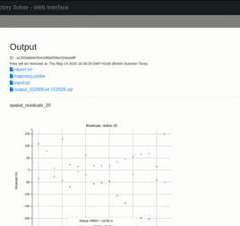

# trajectory

Meteor Trajectory Solver - Web Interface. Supported formats: MILIG, CAMS or RMSJSON 

Using [WesternMeteorPyLib](https://github.com/wmpg/WesternMeteorPyLib)

## Example output

## Building and running

`git submodule update --init --recursive`

`docker build -t trajectory .`

`docker run -p 80:80 trajectory`

Open https://0.0.0.0:80/trajectory/

or when developing:

``docker run -p 80:80 -v `pwd`/app:/app trajectory``
